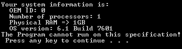
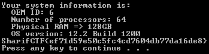

# HI (Reverse, 200)

In the task description we are given the following info:

>The Program is registerd for following system specification:  
>Processor type: Intel Itanium-based  
>Number of processors: 64  
>Physical RAM => 128GB  
>OS version: 12.2 Build 1200  

A little bit info about task file:
>File name: HI2.exe  
>File type: Win32 PE Executable  
>SHA1: 8dd906f847bc21078eeb95af69944a4d966eefec

Quick look at the file in CFF Explorer reveals the following:
>_8_ sections, _2_ of which are **.vmp0** and **.vmp1**  
>TLS directory  
>Export directory  

Just to make sure that we are dealing with VMProtect, let's just take a peek at image's entry point:
```
004F22CE                /E9 54370000           jmp HI2.004F5A27
004F22D3               ^|E9 22B5FFFF           jmp HI2.004ED7FA
004F22D8                |B3 8B                 mov bl,8B
...
004F5A27                 50                    push eax
004F5A28                 60                    pushad
004F5A29                 C74424 20 0BAAB1FF    mov dword ptr ss:[esp+20],FFB1AA0B
004F5A31                 66:C70424 59BA        mov word ptr ss:[esp],0BA59
004F5A37                 C74424 1C 8BC4B62B    mov dword ptr ss:[esp+1C],2BB6C48B
004F5A3F                 885424 04             mov byte ptr ss:[esp+4],dl
004F5A43                 8D6424 1C             lea esp,dword ptr ss:[esp+1C]
004F5A47                 E9 B2110D00           jmp HI2.005C6BFE
```

Now we're 100% sure it's indeed VMProtect.
Ok, but what does it mean?
In general cases VMProtect is used to change (_virtualize_) the code to such form that the original form is lost and unrecoverable. In this case though, it means that authors doesn't want us to play with the application code itself, but they want us to focus on values returned by some system functions.

Debugger settings (ollydbg v1.10)
> Options/Debugging options/Events/System breakpoint  
> StrongOD plugin, check the option "Remove EP one-shot"

Before we take a look into file itself, let's run just run it and see what it says:


That should be enough, let's take a look at the MSDN, and find function(s) that could provide us at least part of the information we need.

The first one we need is `GetSystemInfo()`
``` c++
void WINAPI GetSystemInfo(
  _Out_ LPSYSTEM_INFO lpSystemInfo
);
```

Function returns `SYSTEM_INFO`structure, of which 2 fields are interesting for us.
``` c++
typedef struct _SYSTEM_INFO {
  union {
    DWORD  dwOemId;
    struct {
      WORD wProcessorArchitecture; // *interesting for us*
      WORD wReserved;
    };
  };
  DWORD     dwPageSize;
  LPVOID    lpMinimumApplicationAddress;
  LPVOID    lpMaximumApplicationAddress;
  DWORD_PTR dwActiveProcessorMask;
  DWORD     dwNumberOfProcessors; // *interesting for us*
  DWORD     dwProcessorType;
  DWORD     dwAllocationGranularity;
  WORD      wProcessorLevel;
  WORD      wProcessorRevision;
} SYSTEM_INFO;
```

We need to change these fields accordingly:  
`wProcessorArchitecture` needs to be equal to `PROCESSOR_ARCHITECTURE_IA64`which is `0x0006`  
`dwNumberOfProcessors`needs to be equal to `0x40`

Next function that seems to be interesing for us is `GlobalMemoryStatusEx()`
``` c++
BOOL WINAPI GlobalMemoryStatusEx(
  _Inout_ LPMEMORYSTATUSEX lpBuffer
);
```
Function returns `MEMORYSTATUSEX`structure, of which one field is interesting for us.
``` c++
typedef struct _MEMORYSTATUSEX {
  DWORD     dwLength;
  DWORD     dwMemoryLoad;
  DWORDLONG ullTotalPhys; // *interesting for us*
  DWORDLONG ullAvailPhys;
  DWORDLONG ullTotalPageFile;
  DWORDLONG ullAvailPageFile;
  DWORDLONG ullTotalVirtual;
  DWORDLONG ullAvailVirtual;
  DWORDLONG ullAvailExtendedVirtual;
} MEMORYSTATUSEX, *LPMEMORYSTATUSEX;
```
To satisfy task requirements let's change  `ullTotalPhys` to `0x0000001FFFFFFFFF` .

The last function which output we're going to change is `GetVersion()`
``` c++
DWORD WINAPI GetVersion(void);
```
Return value has the following form `XXXXYYZZ`:
```
XXXX - build
  YY - minor version
  ZZ - major version
```
The expected value thus is:`0x04B0020C`.

And that's it, when everyting was done right, we are given the flag:



Flag: ef71d59e50c5fc4cd7604db77da16de8