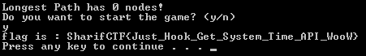

# Maze3 (Reverse, 400)

In the task description we are given the following info:
>Play the game and capture the flag!

A little bit info about task file:
>File name: Maze3.exe  
>File type: Win32 PE Executable  
>SHA1: a7546206830d0c6ca136598615a25a8232903d7b

Tools used:  
>Ollydbg 2 with ScyllaHide plugin

Task is again packed with VMProtect, but this time we're going to dig a big deeper.  
To start with, make sure your debugger is set to `Break on Tls`.

>**Note:**  
>Tls callbacks are executed before VMProtect's Entry Point, that's why we want to start there.

Now we're going to find a one of VMProtect's handlers called `vm-exit`.  
In order to do so, we need to perform a `run trace into` (which will log all executed instructions to file if set up correctly).

Let's now find the first `ret` instruction that is different from the most common ones.   
```
findstr /c:"ret" runtrace.log
```

The output should yield something like:
```
...
main    Maze3.0088A431  retn 3C ESP=0012F90C
main    Maze3.0088A431  retn 3C ESP=0012F90C
main    Maze3.0088A431  retn 3C ESP=0012F90C
main    Maze3.0088A84E  retn 18 ESP=0012FA10 // *interesting for us*
main    ntdll.77F1896E  retn 10 ESP=0012FA34
main    ntdll.77EDF58A  retn 8  ESP=0012FA70
...
```

Having `runtrace.log` opened in our favourite editor, let's now find the beginning of `vm-exit` handler.  
As we've found the right address (in this case `0088A84E`), we need to go up until we reach the beginning of the handler (which is the first instruction after the most common `ret`) which in this case is `0088A1CB`.

Just to clarify the `vm-exit` handler starts at `0088A1CB` and ends at `0088A84E`.

It should look like this:
```
0088A1CB       60                 pushad                                       
0088A1CC       D4 F1              aam 0F1
0088A1CE       FF3424             push dword ptr ss:[esp]
0088A1D1       C60424 9C          mov byte ptr ss:[esp],9C
0088A1D5       89EC               mov esp,ebp
0088A1D7       D2CC               ror ah,cl
0088A1D9       2F                 das
0088A1DA       58                 pop eax
```

Let's copy some of its bytes as we're going to need them later.
```
60 D4 F1 FF 34 24 C6 04 24 9C 89 EC D2 CC 2F 58
```

Change your debugger settings to make a pause at `System breakpoint`.

>**Note:**  
>At this point it doesn't really matter if it's `System breakpoint` or `Entry point of main module`  
>as we are going to run the application eventually.  
>But experience always says: _the sooner (earlier in this case) the better_

Run the application, and in memory view let's search (globally) for `vm-exit` binary pattern we saved earlier.
If we've done everything right, we should have a match on already unpacked code at address `004015AA`.

Now let's move on to `004015AA`, follow the code till `retn 18` and set there hardware logging breakpoint on execution (it should log the destination address of `retn 18`. The expression could simply be `dword ptr [esp+18]`).

Restart the application and run it again.

>**Note:**  
>At this point log window should contain every address that the `vm-exit` handler has reached.

Let's go briefly through the addresses in logs:
```
...
77E2EA51   GetSystemTime                8BFF               mov edi, edi
008B81C0   malloc                       8BFF               mov edi, edi
100334C0   ?sputn@?$basic_streambuf     55                 push ebp
00401967   (!!)                         C745 FC 01000000   mov dword ptr ss:[ebp-4], 1
...
```

The code that is pretty interesing for us is under `00401967`.  
Let's put there hardware breakpoint on execution, remove all other breakpoints, restart the application and run it again.

>**Note:**  
>At this point the application's console window has written `Longest Path has `

As we hit a breakpoint on `00401967`, let's dump a bit of stack.

```
0012FE30   586E4F02
0012FE34   002DE0F4  ucrtbase.002DE0F4
0012FE38   00085DE0
0012FE3C   7FFDF000
0012FE40   10063DB8  offset msvcp140.?cout@std@@3V?$basic_ostream@DU?$char_traits@D@std@@@1@A
0012FE44   00000001
0012FE48   00000206
0012FE4C   004031DC  ASCII "Longest Path has "
0012FE50   00000216
0012FE54   00000000
0012FE58   00000011
0012FE5C   10063DB8  offset msvcp140.?cout@std@@3V?$basic_ostream@DU?$char_traits@D@std@@@1@A
0012FE60   0012FE30  ASCII 02,"On"
0012FE64   0012FF78  Pointer to next SEH record
0012FE68   0040284E  SE handler
0012FE6C   00000002
0012FE70   0012FF3C
0012FE74   0052A1D1  Maze3.0052A1D1
0012FE78   0042EF00  Maze3.0042EF00
0012FE7C   00085DE0
0012FE80   002DE0F4  ucrtbase.002DE0F4
0012FE84   002DE76C  ucrtbase.002DE76C
0012FE88   7FFDF000
0012FE8C   7FA58755
0012FE90   00000000
0012FE94   00000246
0012FE98   002DE76C  ucrtbase.002DE76C
0012FE9C   11798B86
0012FEA0   002C133F  RETURN to ucrtbase.002C133F from ucrtbase.00232CBB
0012FEA4   00000000
0012FEA8   005F2206  Maze3.005F2206
0012FEAC   00000206
0012FEB0   00000286
0012FEB4   F394D17E
0012FEB8   01A60020
0012FEBC   00000246
0012FEC0   00000246
0012FEC4   00407074  RETURN to Maze3.00407074 from Maze3.00406DC0
0012FEC8   00402300  Maze3.00402300
0012FECC   00085DE0
0012FED0   00432C65  Maze3.00432C65
0012FED4   00000213
0012FED8   00A96210
0012FEDC   0202F000
```

Having it saved, allow an app to continue so it's not stuck on breakpoint anymore.

>**Note:**  
>At this point the application's console window has written `Longest Path has 548320 nodes!`

Let's convert `548320` to hex (`0x85DE0`) and check for it against the stack we previously saved.  
We should have 3 matches:
```
0012FE38   00085DE0
...
0012FE7C   00085DE0
...
0012FECC   00085DE0
```

You may now guess what would happen if we changed these values to let say `0`.  
I'll left it for your as practice.

Anyway, we got the flag:  


Flag: Just_Hook_Get_System_Time_API_WooW
